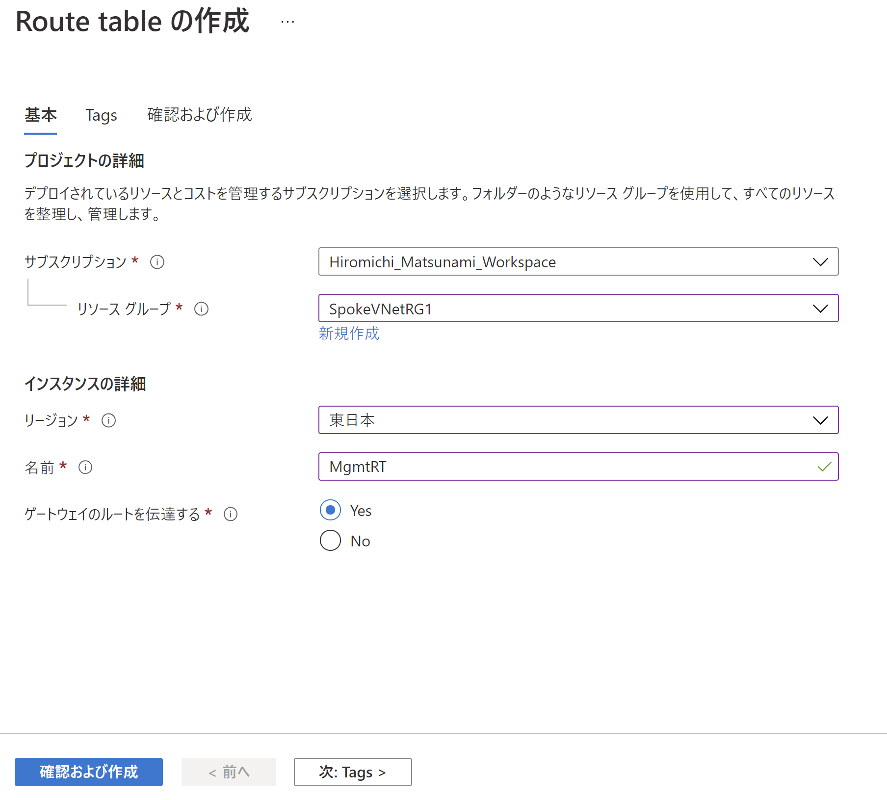
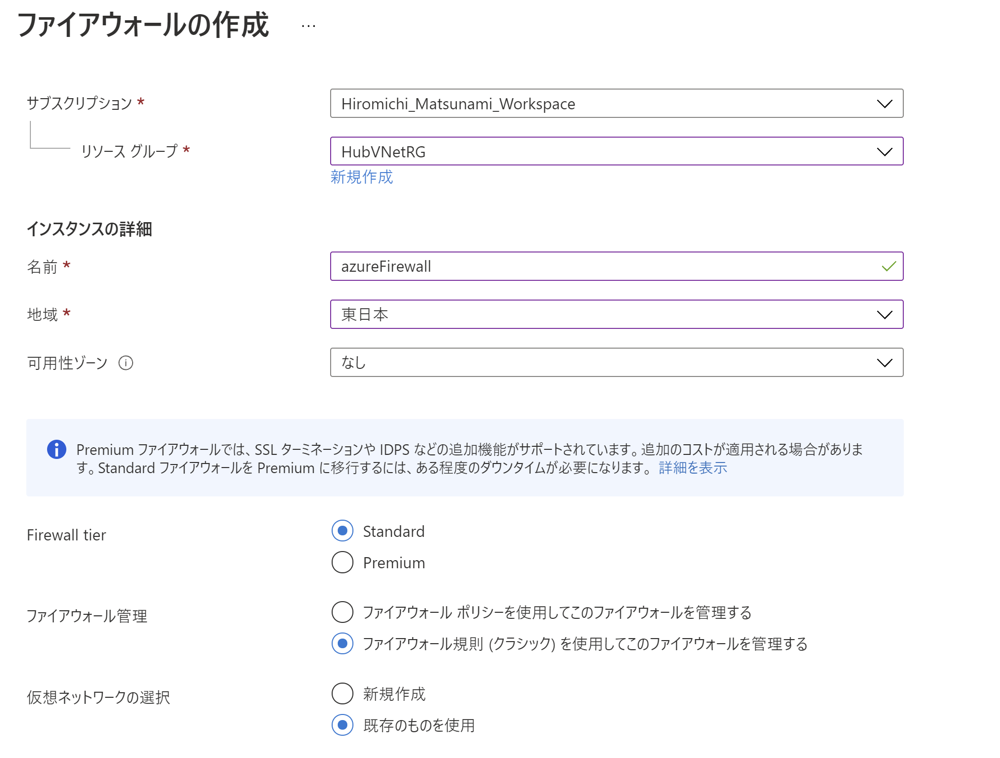
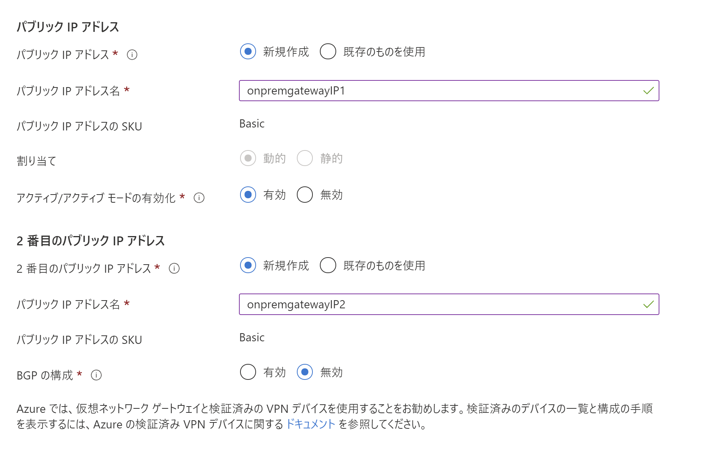
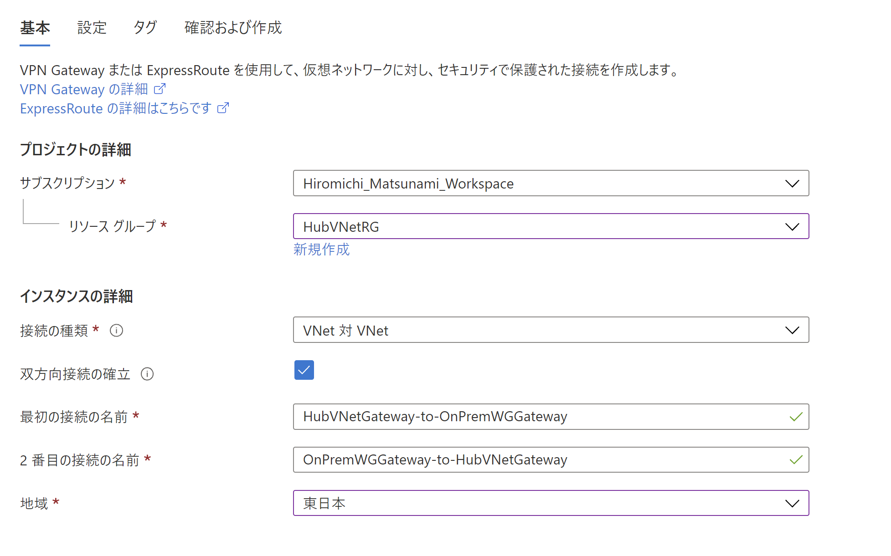

# Network-Hands-On
In this hands-on lab, we will see how Hub &amp; Spoke network topology works and what component it consists of.  
Before this hands-on, you need to finish several steps from the link below.  
[Before the HOL](https://github.com/HIROMICHIMatt/Network-hands-on-main/tree/main/Before%20the%20hands-on%20lab)  

#**Contents**

<!-- TOC -->

- [Enterprise-class networking in Azure hands-on lab step-by-step](#enterprise-class-networking-in-azure-hands-on-lab-step-by-step)
  - [Architecture Image](#architecture-image)
  - [Exercise 1: Create a Virtual Network and provision subnets](#exercise-1-create-a-virtual-network-and-provision-subnets)
    - [Task 1: Create a Virtual Network](#task-1-create-a-virtual-network)
    - [Task 2: Configure subnets](#task-2-configure-subnets)
    - [Task 3: Create another Virtual Network](#task-3-create-another-virtual-network)
  - [Exercise 2: Virtual Network Peering](#exercise-2-virtual-network-peering)
    - [Task 1: Configure VNet peering HubVNet to SpokeVNet2 and Vice Versa](#task-1-configure-vnet-peering-HubVNet-to-SpokeVNet2-and-vice-versa)
  - [Exercise 3: Configure Network Security Groups and Application Security Groups](#exercise-3-configure-network-security-groups-and-application-security-groups)
    - [Task 1: Create application security groups](#task-1-create-application-security-groups)
    - [Task 2: Configure application security groups](#task-2-configure-application-security-groups)
    - [Task 3: Create network security group](#task-3-create-network-security-group)
  - [Exercise 4: Create route tables with required routes](#exercise-4-create-route-tables-with-required-routes)
    - [Task 1: Create route tables](#task-1-create-route-tables)
    - [Task 2: Add routes to each route table](#task-2-add-routes-to-each-route-table)
  - [Exercise 5: Configure n-tier application and validate functionality](#exercise-5-configure-n-tier-application-and-validate-functionality)
    - [Task 1: Create a load balancer to distribute load between the web servers](#task-1-create-a-load-balancer-to-distribute-load-between-the-web-servers)
    - [Task 2: Configure the load balancer](#task-2-configure-the-load-balancer)
  - [Exercise 6: Provision and configure Azure firewall solution](#exercise-6-provision-and-configure-azure-firewall-solution)
    - [Task 1: Provision the Azure firewall](#task-1-provision-the-azure-firewall)
    - [Task 2: Create Firewall Rules](#task-2-create-firewall-rules)
    - [Task 3: Create VM for Management](#task-3-create-vm-for-management)
    - [Task 4: Associate route tables to subnets](#task-4-associate-route-tables-to-subnets)
  - [Exercise 7: Configure Site-to-Site connectivity](#exercise-7-configure-site-to-site-connectivity)
    - [Task 1: Create OnPrem Virtual Network](#task-1-create-onprem-virtual-network)
    - [Task 2: Configure gateway subnets for on premise Virtual Network](#task-2-configure-gateway-subnets-for-on-premise-virtual-network)
    - [Task 3: Create the first gateway](#task-3-create-the-first-gateway)
    - [Task 4: Create the second gateway](#task-4-create-the-second-gateway)
    - [Task 5: Connect the gateways](#task-5-connect-the-gateways)
  - [Exercise 8: Validate connectivity from 'on-premises' to Azure](#exercise-8-validate-connectivity-from-on-premises-to-azure)
    - [Task 1: Create a virtual machine to validate connectivity](#task-1-create-a-virtual-machine-to-validate-connectivity)
    - [Task 2: Configure routing for simulated 'on-premises' to Azure traffic](#task-2-configure-routing-for-simulated-on-premises-to-azure-traffic)
  - [Exercise 9: Create a Network Monitoring Solution](#exercise-9-create-a-network-monitoring-solution)
    - [Task 1: Create a Log Analytics Workspace](#task-1-create-a-log-analytics-workspace)
    - [Task 2: Configure Network Watcher](#task-2-configure-network-watcher)
  - [Exercise 10: Using Network Watcher to Test and Validate Connectivity](#exercise-10-using-network-watcher-to-test-and-validate-connectivity)
    - [Task 1: Configuring the Storage Account for the NSG Flow Logs](#task-1-configuring-the-storage-account-for-the-nsg-flow-logs)
    - [Task 2: Configuring Diagnostic Logs](#task-2-configuring-diagnostic-logs)
    - [Task 3: Reviewing Network Traffic](#task-3-reviewing-network-traffic)
    - [Task 4: Network Connection Troubleshooting](#task-4-network-connection-troubleshooting)
  - [After the hands-on lab](#after-the-hands-on-lab)

<!-- /TOC -->

# Architecture Image
  

## Exercise 1: Create a Virtual Network and provision subnets

Duration: 15 minutes

### Task 1: Create a Virtual Network

1.  Azure portalにアクセスし、**+ Create a resource**から **Virtual network** を選択し、 **Create**をクリック。 

2.  **Create virtual network** の **Basic** タブにて、以下の情報を入力。

    -  Subscription: **Select your subscription**.
  
    -  Resource group: Select **Create new**, and enter the name **HubVNetRG**.

    -  Name: **HubVNet**

    -  Location: **Japan East**

3.  **Next: IP Addresses** をクリック。

    
   
4.  **Create virtual network - IP Addresses** タブにて、以下の情報を入力。

    -  IPv4 Address space: **10.7.0.0/20**

    - **+ Add subnet** をクリックし、以下の情報を入力。その後 **Add**をクリック。 

      - Subnet name: **GatewaySubnet**

      - Subnet address range: **10.7.0.0/29**

5.   **Next: Security**をクリック。

6.   **Create virtual network Security** タブで **BastionHost**を有効化する。

7.  以下の情報を入力。

    -  Bastion name: **WGBastion**

    -  AzureBastionSubnet address space: **10.7.5.0/24**

    -  Public IP address: **Create new**
  
    -  Public IP address name: **BastionPublicIP**

8.  その他のオプションはそのままにしておく。

    

9.  **Review + Create**をクリック。

10. 入力内容を確認し、**Create**をクリック。

    

11. リソースが作成されたら、**Go to Resource**をクリック。

### Task 2: Configure subnets

1.  HubVNetRG 仮想Networkに行き、**Settings**セクション下の**Subnets**をクリック。

    

2.  **+Subnet**をクリック。

    

3.  **Add subnet** ブレードで以下の情報を入力。

    -  Name: **AzureFirewallSubnet** (This name is fixed and cannot be changed.)

    -  Address range: **10.7.1.0/24**

    -  Network security group: **None**

    -  Route table: **None**

    -  Service Endpoints: **Leave as Default**

    

4. **保存**をクリックし、以下のようにサブネットが追加されたことを確認。
   
   

### Task 3: Create another Virtual Network

1. 以下の情報を入力し、新しい仮想Networkを作成する。

    -  Subscription: **Select your subscription**.
  
    -  Resource group: Select **Create new**, and enter the name **SpokeVNetRG1**.

    -  Name: **SpokeVNet1**

    -  Location: **Japan East**

    

    -  IPv4 Address space: **10.9.0.0/20**

    -  Subnet Name: **Management**

    -  Subnet address range: **10.9.2.0/25**

    

## Exercise 2: Virtual Network Peering

Duration: 20 Minutes

### Task 1: Configure VNet peering HubVNet to SpokeVNet2 and Vice Versa

1.  **HubVNetRG**リソースグループの中から、 **HubVNet**を選択し、**Settings**セクション下の**Peerings**をクリック。

2.  **+ Add**をクリック。

    

3.  以下の情報を使って新しいピアリングを作成する。 入力後 **Add** をクリックする。

    - Peering link name (This virtual network): **VNETPeering_HubVNet-SpokeVNet1**

    - Traffic to remote virtual network: **Allow (default)**

    - Traffic forwarded from remote virtual network: **Allow (default)**
  
    - Peering link name (Remote virtual network: **VNETPeering_SpokeVNet1-HubVNet**

    - Virtual Network: **SpokeVNet1**

    - Traffic to remote virtual network: **Allow (default)**

    - Traffic forwarded from remote virtual network: **Allow (default)**

    

3.  以下の情報を使ってもう一つ新しいピアリングを作成する。 入力後 **Add** をクリックする。

    - Peering link name (This virtual network): **VNETPeering_HubVNet-SpokeVNet2**

    - Traffic to remote virtual network: **Allow (default)**

    - Traffic forwarded from remote virtual network: **Allow (default)**
  
    - Peering link name (Remote virtual network: **VNETPeering_SpokeVNet2-HubVNet**

    - Virtual Network: **SpokeVNet2**

    - Traffic to remote virtual network: **Allow (default)**

    - Traffic forwarded from remote virtual network: **Allow (default)**

    

## Exercise 3: Configure Network Security Groups and Application Security Groups

Duration: 20 minutes

このエクササイズでは、ネットワークセキュリティグループとアプリケーションセキュリティグループの作成を通じて、トラフィック制限のかけ方を理解します。

### Task 1: Create application security groups

1.  **+ Create a resource**をクリックします。 **Application security group**をクリックし、 **Create**をクリック。

2.  **Basics** タブにて以下の情報を入力し、 **Review + create**をクリック。

    -  Subscription: **Select your subscription**.

    -  Resource group: **SpokeVNetRG2**

    -  Name: **WebTier**

    -  Region: **Japan East** 

    

3.  検証に成功後、 **Create**をクリック。 

4.  前のステップを繰り返し、**DataTier** というアプリケーションセキュリティグループを作成する。

    -  Subscription: **Select your subscription**.

    -  Resource group: **SpokeVNetRG2**

    -  Name: **DataTier**

    -  Region: **Japan East**

    

### Task 2: Configure application security groups

1.  **Virtual machines** のリソースに行き、**WGWEB1**をクリック。

2.  **Settings**セクション下の**Networking**をクリック。

3.   **Application security groups** タブをクリックし、**Configure the application security groups**をクリック。  

  

4.  ドロップダウンから **WebTier**を選択し、 **Save**をクリック。

    

5.  **WGWEB2** に対しても上記のステップを繰り返し、**WebTier** アプリケーションセキュリティグループをアタッチする。
6.  1-4のステップを今度は**WGSQL1**に行い、DataTierのアプリケーションセキュリティグループをアタッチする。 

### Task 3: Create network security group

1.  **+ Create a resource**をクリック。**Network security group**を選択し、**Create**をクリック。

2.  以下の情報を入力し、**Review + Create**をクリック。その後、 **Create**をクリック。
   
    -  Subscription: **Select your subscription**.

    -  Resource group: **SpokeVNetRG2**

    -  Name: **WGAppNSG1**

    -  Region: **Japan East** (This must match the location in which you created the **SpokeVNet2** virtual network.)

    

3.  デプロイ完了後、リソースに移動する。
4.  **Settings**セクション下の**Inbound security rules**をクリック。
   

5.   **+Add**をクリックする。
   

6.  以下の情報を入力し、**Add**をクリック。

    -  Source: **Application security group**

    -  Source application security group: **WebTier**

    -  Source port ranges: **\***

    -  Destination: **Application security group**

    -  Destination application security group: **DataTier**

    -  Destination port ranges: **1433**

    -  Protocol: **TCP**

    -  Action: **Allow**

    -  Priority: **100**

    -  Name: **AllowDataTierInboundTCP1433**

7.  次のルールを設定するため、再度**+Add**をクリック。

8.  以下の情報を入力し、 **Add**をクリック。

    -  Source: **Any**

    -  Source port ranges: **\***

    -  Destination: **Application security group**

    -  Destination application security group: **WebTier**

    -  Destination port ranges: **80**

    -  Protocol: **TCP**

    -  Action: **Allow**

    -  Priority: **150**

    -  Name: **AllowAnyWebTierInboundTCP80**

    

9.  次のルールを設定するため、再度**+Add**をクリック。

10. 以下の情報を入力し、 **Add**をクリック。

    -  Source: **IP Addresses**

    -  Source IP addresses/CIDR ranges: **10.7.5.0/24,10.9.2.0/25** (HubのBastionサブネットとSpokeVNet1の管理用サブネットのアドレス範囲。)

    -  Source port ranges: **\***

    -  Destination: **Any**

    -  Destination port ranges: **3389**

    -  Protocol: **Any**

    -  Action: **Allow**

    -  Priority: **200**

    -  Name: **AllowMgmtInboundAny3389**

11. 次のルールを作成。**+Add**をクリック。

12. 以下の情報を入力し、**Add**をクリック。

    -  Source: **Service Tag**

    -  Source service tag: **VirtualNetwork**

    -  Source port ranges: **\***

    -  Destination: **Application security group**

    -  Destination application security group: **DataTier**

    -  Destination port ranges: **\***

    -  Protocol: **Any**

    -  Action: **Deny**

    -  Priority: **1000**

    -  Name: **DenyVNetDataTierInbound**

13. 次のルールを作成。**+Add**をクリック。

14. 以下の情報を入力し、**Add**をクリック。 

    -  Source: **Service Tag**

    -  Source service tag: **VirtualNetwork**

    -  Source port ranges: **\***

    -  Destination: **Application security group**

    -  Destination application security group: **WebTier**

    -  Destination port ranges: **\***

    -  Protocol: **Any**

    -  Action: **Deny**

    -  Priority: **1050**

    -  Name: **DenyVNetWebTierInbound**  

   
    以下のような画面になっていることを確認。
    

15.  **Settings**セクション下の**Subnets**をクリックし、 **+ Associate**をクリック。

16. **SpokeVNet2**仮想ネットワークの**AppSubnet**と**DataSubnet**に対し、関連付けを行う。(それぞれのサブネットに対して繰り返し設定する。)

17. それぞれのサブネットに設定するときには**OK**をクリック。

## Exercise 4: Create route tables with required routes

Duration: 15 minutes

ルートテーブルはユーザー定義ルート(UDR)をひとまとめにするもので、サブネットに関連付けられて用いられます。UDRはシステムのデフォルトルート以外のトラフィックを可能にします。例えば、Azureからのアウトバウンド通信はすべてAzure Firewallを通るようにする、といったように定義することでその通信が可能になります。

### Task 1: Create route tables

1.  ポータルのメニューから **+ Create a Resource**をクリックして、**Route table** を検索。その後、**Create**をクリック。

2.  以下の情報を入力。

    -  Subscription: **Select your subscription**.

    -  Resource group: Select **SpokeVNetRG1** from the drop down.

    -  Region: **Japan East**

    -  Name: **MgmtRT**

    -  Propagate gateway routes: **Yes**

3.  以下のようになっていることを確認して、 **Review + Create** をクリック。その後、 **Create**をクリック。

    

4.  ステップ 1 と 2 を繰り返し、 **AppRT** ルートテーブルを作成する。

    -  Subscription: **Select your subscription**.

    -  Resource group: Select **SpokeVNetRG2** from the drop down.

    -  Region: **Japan East**

    -  Name: **AppRT**

    -  Propagate gateway routes: **Yes**

5.  作成後、ルートテーブルのリソースを確認しに行ったときに、以下のように見えているか確認する。

    

### Task 2: Add routes to each route table

1.  **AppRT**を選択し、**Settings**セクション下の**Routes**をクリック。

    

2.  **+ Add**をクリックし、以下の情報を入力した後に、 **OK**をクリック。

    -  Route name: **AppToInternet**

    -  Address prefix: **0.0.0.0/0**

    -  Next hop type: **Virtual appliance**

    -  Next hop address: **10.7.1.4**(後に設定するFirewallのIP)

    

3.  **MgmtRT**に対してルートを作成する。

    -  Route name: **MgmtToApp**

    -  Address prefix: **10.8.0.0/25**

    -  Next hop type: **Virtual appliance**

    -  Next hop address: **10.7.1.4**

4.  **MgmtRT**に対してもう一つルートを作成する。

    -  Route name: **MgmtToOnPremises**

    -  Address prefix: **192.168.0.0/16**

    -  Next hop type: **Virtual network gateway**

    -  Next hop address: **Leave blank**.

5. **MgmtRT** ルートテーブルに以下2つルートが作成されていることを確認する。

    

    >**Note:** まだサブネットと関連付けられていないので、ここまで設定したルートはトラフィックに影響を及ぼさない。関連付けは後に行う。
## Exercise 5: Configure n-tier application and validate functionality

Duration: 20 minutes

このエクササイズでは、ロードバランサーを作成し、Webサーバー間のトラフィック分散を設定する。 

### Task 1: Create a load balancer to distribute load between the web servers

1.  Azureポータルのメニューから**Load balancers**を選択し、**+ Create**をクリックする。

2.  **Basics** と**Front end IP configuration**タブにて以下の情報を入力する。

    -  Subscription: **Select your subscription**.

    -  Resource group: **SpokeVNetRG2**

    -  Name: **WGWEBLB**

    -  Region: **Japan East**

    -  Type: **Internal**

    -  SKU: **Standard**

    -  Name(Front end IP): **WGWEBLBFE**

    -  Virtual network: **SpokeVNet2**

    -  Subnet: **AppSubnet (10.8.0.0/25)**

    -  IP address assignment: Select **Static** and enter the IP address **10.8.0.100**.

    以下のようになっていることを確認し、 **Review + create** をクリックし、 **Create**をクリック。

    
    

### Task 2: Configure the load balancer

1.  作成したロードバランサーのリソースに移動する。

2.  **Backend pools**をクリックし、**+Add**をクリックする。

    

3. プール名に**LBBE**と入力し、**Virtual machine**セクションで **+Add**をクリックする。

    

4. **WGWEB1** と**WGWEB2** 仮想マシンを選択し、**Add**をクリック。(WGWEB1が選択できないので、原因を確かめにWGWEB1仮想マシンのページに行く。パブリックIPが割り当てられていることが確認されたら、そのパブリックIPの関連付けを解除し、再度この手順に戻る。)

5.  画面一番下の**Add**をクリック。

6.  以下のようになっていることを確認する。

    

7. **Settings**セクション下の**Health Probes**を選択し、**+ Add**をクリックして以下の情報を入力。

    -  Name: **HTTP**

    -  Protocol: **HTTP**

    

8.  **Add**をクリック。

9.  次に**Load balancing rules**を見つけ、**+Add**をクリックし、以下のスクリーンショットの情報を入力。最後に**OK**をクリック。

    - Name: **HTTP**
  
    - Leave the rest as defaults.

    

    **検証に2-3分かかります。**

10. Bastionを使って、WGWEB1 に接続。 以下のURLにアクセス <http://10.8.0.100>し、WEB1かWEB2のどちらかのアプリにアクセスできることを確認する。アプリのページが開けたら、このエクササイズは完了。

## Exercise 6: Provision and configure Azure firewall solution

Duration: 15 minutes

このエクササイズでは、Azure Firewallを構築します。

### Task 1: Provision the Azure firewall

1.  ポータルのメニューから **+ Create a resource**をクリック。 **Firewall**を発見し、**Create**をクリック。

2.  **Basics** タブで以下の情報を入力。 

    -  Subscription: select your subscription.

    -  Resource group: **HubVNetRG**

    -  Name: **azureFirewall**

    -  Region: **Japan East**

    - Firewall management: **Use Firewall rules (classic) to manage this Firewall**

    -  Choose a Virtual network: **Use existing**

    - Virtual network: **HubVNet**

    -  Public IP address: **(Add new) azureFirewall-ip**

    
    

3.  **Review + create** をクリックし、**Create** をクリック。

### Task 2: Create Firewall Rules

**HubVNetRG**内にAzure Firewallが作成されたら、Inbound/Outboundルールを設定しに行く。
1.  **HubVNetRG**へ進む。

2.  Azure FirewallとそのIPが作成されていることを確認する。

3.   **azureFirewall-ip** を選択し、IPアドレスを後のタスクのためにコピーしておく。

4.  **azureFirewall**をクリックし、 **Overview** ページから **Rules (classic)** を選択。(**Settings**セクションの下)

    

5.  **+ Add NAT Rule collection**を選択し、以下の情報を入力し、NATルールを作成する。最後に**Add**をクリック。

    -  Name: **NATRuleCollection1**

    -  Priority: **250**

    -  Rules name: **IncomingHTTP**

    -  Protocol: **TCP**

    -  Source: **\***

    -  Destination Address: Type the public IP address assigned to the firewall you identified earlier in this task.

    -  Destination ports: **80** (to allow HTTP traffic)

    -  Translated Address: **10.8.0.100** (Private IP of the Azure Load Balancer you deployed earlier in this lab.)
        
    -  Translated Port: **80**

6.  Back on the **azureFirewall - Rules (classic)** page, select the newly created NAT rule collection. Add another rule for HTTPS, as illustrated on the following screenshot (alternatively you could create a single rule for both HTTP and HTTPS).

    - Rules name: **IncomingHTTPS**
  
    - Protocol: **TCP**
  
    - Source: **\***
  
    - Destination Address: Type the public IP address assigned to the firewall you identified earlier in this task.
  
    - Destination ports: **443**
  
    - Translated Address: **10.8.0.100**
  
    - Translated Port: **443**

    

7.  ルールが作成されたことを確認する。

8.  次に**Network rule collection**を選択し、**+ Add Network Rule collection**をクリック。以下の情報を入力し、ロードバランサーへのHTTP/HTTPS接続を許可するルールを作成する。

    -  Name: **NetworkRuleCollectionAllow1**

    -  Priority: **100**

    -  Action: **Allow**

    -  Rules name (IP Addresses): **IncomingWeb**

    -  Protocol: **TCP**

    -  Source: **\***

    -  Destination Address: **10.8.0.100**

    -  Destination ports: **80,443**

9.  Remote Desktop接続に関するルールを一つ作成する。 

    -  Rules name (IP Addresses): **IncomingMgmtRDP**

    -  Protocol: **TCP**

    -  Source: **10.9.2.0/25**

    -  Destination Address: **10.8.0.0/25**

    -  Destination ports: **3389**

    

10. **Add** をクリック。

### Task 3: Create VM for Management

1.  仮想マシンの作成画面に進む。

2.  以下の情報を入力。

    

3.  ユーザー名：**demouser**, パスワード：**demo@pass123**を使用する。 

    

4.  **Disk**タブで**Standard SSD**をOSのディスクとして選択。
    

5.  **Network**タブでは、以下の内容を入力。
    

6.  **Create**をクリックし、仮想マシンを作成。

7.  Bastionを利用して**MgmtVM**に接続。その後、RDPで**WEBVM1**に接続できるかを確認。(ここでは接続できないのが正解。)

8.  **MgmtVM**からロードバランサーのアドレスを入力し、(http://10.8.0.100) アプリにアクセスできるか確認する。(ここでは接続できないのが正解。)

### Task 3: Associate route tables to subnets

1.  **SpokeVNetRG2** リソースグループに進む。

2.  **AppRT**を選択し、**Subnets**をクリック。その後 **+ Associate**をクリック。

    

3.   **SpokeVNet2** を **Virtual network**ドロップダウンメニューで選択し、 **AppSubnet**を**Subnet**ドロップダウンで選択。 

   

4.  **OK** をクリック。

5.   **SpokeVNetRG1**リソースグループに行き、 **MgmtRT**を選択し、**Subnets**をクリック。

6.  **+ Associate**をクリック。

7.  以下のように選択。 

    

8.  **OK**をクリック。その後Task2のステップ7-8を再度試してみる。今度はどちらも接続できることを確認する。

## Exercise 7: Configure Site-to-Site connectivity

Duration: 60 minutes

このエクササイズでは、VPN Gatewayを用いたSite-to-Site接続を利用して疑似的にオンプレとAzure環境の接続を行ってみます。そのためにここでオンプレミス環境となるネットワークを作成し、Gatewayを配置し、接続を確立します。

### Task 1: Create OnPrem Virtual Network

1.  メニューの **+ Create a resource** から**Virtual network**を発見し、**Create**をクリックします。

2.  以下の情報を入力します。

    -  Subscription: **Select your subscription**.

    -  Resource group: Select **Create new**, and enter the name **OnPremVNetRG**.

    -  Name: **OnPremVNet**

    -  Region: **Japan West** (Make sure this is **NOT** the same location you have specified in the previous exercises.)

3.  以下のスクリーンショットのようになっていることを確認する。
    

4.  **Next: IP Addresses**へと進む。

5. **IP addresses** タブでは以下の情報を入力。

    -  Address space: **192.168.0.0/16**

    - Select **+ Add subnet** then enter the following information in the blade that appears on the right and select **Add**.

      -  Subnet name: **OnPreMgmt**

      -  Subnet address range: **192.168.2.0/29**

6. **Review + create** をクリックし、 **Create**をクリック。

### Task 2: Configure gateway subnets for on premise Virtual Network

1.  **OnPremVNet**のリソースページに行き、**Subnets**をクリック。

2.  **+ Gateway subnet**をクリック。

    

3.  以下の情報を入力して、**Save**をクリック。

    -  Subnet address range: **192.168.1.0/29**

    -  Route table: **None** (We will add this later.)

    

### Task 3: Create the first gateway

1.  ポータルメニューの　**+ Create a resource**から　**Virtual Network gateway**を発見し、 **Create**をクリック。

2.  以下の情報を入力し、 **Review + create**:

    -  Subscription: **Select your subscription**.

    -  Name: **OnPremWGGateway**

    -  Region: **Japan West** (This must match the location in which you created the **OnPremVNet** virtual network.)

    -  Gateway type: **VPN**

    -  VPN type: **Route-based**

    -  SKU: **VpnGw1**

    -  Virtual network: **OnPremVNet**

    -  Public IP address: **Create new**

    -  Public IP address name: **onpremgatewayIP1**

    -  Enable active-active mode: **Enabled**

    -  Second Public IP address name: **onpremgatewayIP2**

    -  Configure BGP: **Disabled**

    
    

3.   **Review + Create** をクリックし、 **Create**をクリック。

    > **Note:** デプロイに30-45 分かかるので、次のタスクに進む。

### Task 4: Create the second gateway

1.  ポータルメニューの**+ Create a resource** から再度**Virtual Network gateway** を選択し、**Create**をクリック。

2. 以下の情報を入力し、 **Review + create**をクリック。

    -  Subscription: **Select your subscription**.

    -  Name: **HubVNetGateway**

    -  Region: **Japan East** (This must match the location in which you created the **HubVNet** virtual network.)

    -  Gateway type: **VPN**

    -  VPN type: **Route-based**

    -  SKU: **VpnGw1**

    -  Virtual network: **HubVNet**

    -  Resource group: **HubVNetRG**

    -  Public IP address: **Create new**

    -  Public IP address name: **vnet1gatewayIP1**

    -  Enable active-active mode: **Enabled**

    -  Second Public IP address name: **vnet1gatewayIP2**

    -  Configure BGP: **Disabled**

3.  **Review + Create**をクリックし、確認後**Create**をクリック。

    > **Note:** このデプロイも30-45分かかる。次のタスクに進むには完了するまで待たなければならない。
4.  デプロイが完了したことを確認し、次に進む。

### Task 5: Connect the gateways

1.  ポータルメニューの**+ Create a resource** から**Connection**を発見し、クリック。

2.  **Create**をクリック。

3.  **Basics** タブで、**Connection type** を **VNet-to-VNet**に設定し、 **HubVNetRG** リソースグループに作成。以下の情報を入力。

    

4.  次のタブで以下の情報を入力。

    

5.  **Create**をクリックして、接続を作成する。

6.  検索バーに**Connections**と入力し、リソースの一覧に移動する。

    

7.  ステータスを確認して、**Unknown** から**Connected**に変更するまで待つ。定期的に**更新**をクリックして確認する。完了までに5-10分かかります。

    

## Exercise 8: Validate connectivity from 'on-premises' to Azure

Duration: 30 minutes

このエクササイズで、オンプレとAzureの接続をシミュレーションします。

### Task 1: Create a virtual machine to validate connectivity

1.  オンプレ用の仮想マシンを作成する。検索バーから仮想マシンを検索し、**Create**をクリック。

2.  **Basics** タブで以下の情報を入力し、**Next : Disks >** へと進む。

    -  Subscription: **Select your subscription*.

    -  Resource group: Select **Create new** and enter **OnPremVMRG**.

    -  Virtual machine name: **OnPremVM**

    -  Region: **Japan West** (This must match the region in which you created the OnPremVNet virtual network.)

    -  Availability options: **No infrastructure redundancy required**

    -  Image: **[smalldisk] Windows Server 2016 Datacenter - Gen1**

    -  Size: **Standard DS1 v2**

    -  User name: **demouser**

    -  Password/Confirm password: **demo\@pass123**

    -  Public inbound ports: **Allow selected ports**

    -  Select inbound ports: **RDP**

3.  **Disks**タブにて、以下の情報を入力し、**Next : Networking >**へと進む。

    -  OS disk type: **Premium SSD**

4.  **Networking**タブにて、以下の情報を入力し、**Next : Management >**へと進む。

    -  Virtual network: **OnPremVNet**

    -  Subnet: **OnPreMgmt (192.168.2.0/29)**

    -  Public IP: **(new)OnPremVM-ip**

    -  NIC network security group: **Basic**

    -  Public inbound ports: **Allow selected ports**

    -  Select inbound ports: **RDP**

    -  Accelerated networking: **Unchecked**

    -  Place this virtual machine behind an existing load balancing solution: **Unchecked**

5.  **Management** タブにて、以下の情報を入力し、**Review + create**へと進む。

    -  Boot diagnostics: **Disable**

    -  Enable OS guest diagnostics: **Unchecked**

    -  System assigned managed identity: **Unchecked**

    -  Enable auto-shutdown: **Unchecked**

6.  設定内容を確認し、 **Create**をクリックする。

### Task 2: Configure routing for simulated 'on-premises' to Azure traffic

現段階では、"オンプレ"(OnPremVNet)からAzure(HubVNet)にパケットが送られるときにAzure Firewallを通らないため、ルートテーブルを一つ作成し、Azure Firewallを通るようにする。

1.   **Route tables**のリソース一覧に移動する。

2.  **Route tables** にて**+ Add**をクリック。

3.  以下の情報を入力する。

    -  Subscription: **Select your subscription**.

    -  Resource group: Select the drop-down menu, and select **HubVNetRG**.

    -  Region: **Japan East** (This must match the location in which you created the **HubVNet** virtual network.)

    -  Name: **HubAzureVNetGWRT**

    -  Propagate gateway routes: **Yes**

    

4.  **Review + create** をクリックし、 **Create**をクリック。

5.  デプロイ完了後、リソースに移動。

6.  **Settings**セクション下の**Routes**をクリック。

7.  **+Add**をクリック。以下の情報を入力し、**OK**をクリック。

    -  Route name: **OnPremToAppSubnet**

    -  Address prefix: **10.8.0.0/25**

    -  Next hop type: **Virtual appliance**

    -  Next hop address: **10.7.1.4**

    

8.  **Settings**セクション下の**Subnets**をクリック。

9.  **+ Associate**をクリック。

10. 以下のように仮想ネットワークとサブネットを選択。

    

    >**Note:** At this point, you have configured your enterprise network. You should be able to test your Enterprise Class Network from one region to another. Your testing can include the following scenarios:
    -  On the 'on-premises' virtual machine (OnPremVM), attempt to initiate a Remote Desktop session to any virtual machine on the AppSubnet (10.8.0.0/25). Note that this should fail since it is blocked by Azure Firewall.

    -  In the Azure portal, navigate to and browse to the web application deployed to the SpokeVNet2 via the private IP address of the Azure Load Balancer(10.8.0.100). Note that this traffic is routed (and allowed) via Azure Firewall.

    -  In the Azure portal, navigate to the WGWEB1 VM and initiate a Bastion connection session to the WGWEB1 virtual machine by selecting **Connect** and **Bastion**. This should be successful since it is allowed by Azure Firewall and Azure Bastion Host. 

    -  In the Azure portal, navigate to the WGWEB1 VM and initiate a Bastion connection session to the WGWEB2 virtual machine by selecting **Connect** and **Bastion**. This should be successful since it is allowed by Azure Firewall and Azure Bastion Host. 

    -  From within the WGWEB1 VM Bastion connection session, initiate a Remote Desktop session to the WGSQL1 via its private IP address (10.8.1.4). This should be successful since it is allowed by Azure Firewall.

以下オプションになります。

## Exercise 9: Create a Network Monitoring Solution

Duration: 15 minutes

### Task 1: Create a Log Analytics Workspace

1.  From your **LABVM**, connect to the Azure portal, select **+ Create a resource**, and in the **Search the Marketplace** box, search for and select **Log analytics workspace**. Select **Create**.

2.  On the **Create workspace** blade, enter the following information:

    -  Subscription: **Select your subscription**.

    -  Resource group: Select **Create new**, and enter the name **MonitoringRG**.

    -  Name: **Enter a unique name all lowercase**

    -  Location: **East US**

3.  Upon completion, it should look like the following screenshot. Validate the information is correct, and select **Review + create** then **Create**.

    

### Task 2: Configure Network Watcher

1.  From your **LABVM**, connect to the Azure portal, select **All Services** on the left navigation, and in the Category list, select **Networking** followed by selecting **Network Watcher**.

    

2.  In the **Overview** blade, ensure that **NetworkWatcher_southcentralus** and **NetworkWatcher_eastus** is listed.

3.   If they are not listed, add them to the list using the **+ Add** button.

   

## Exercise 10: Using Network Watcher to Test and Validate Connectivity

Duration: 60 minutes

In this exercise, you will collect the flow log and perform connectivity from your simulated on-premises environment to Azure. This will be accomplished by using the Network Watcher Service in the Azure Platform.

### Task 1: Configuring the Storage Account for the NSG Flow Logs

1. On the Azure portal select **+ Create a resource**. Select **Storage Account**.

2. On the **Create Storage account** blade. Enter the following information, and select **Review + Create** then select the **Create** button:

    -  Subscription: **Your Subscription**

    -  Resource Group: **MonitoringRG** (Use the existing resource group created earlier.)

    -  Storage Account Name: **This must be Unique and alphanumeric, lowercase and no special characters.**

    -  Location: **South Central US**

    -  Performance: **Standard**

    -  Account Kind: **StorageV2 (general purpose v2)**

    -  Replication: **Locally-redundant storage (LRS)**

    

   >**Note:** Ensure the storage account is created before continuing.
3. Repeat steps 1 and 2, but select **East US** for the region and give it a different name.

4. On the Azure portal select **All services** at the left navigation. From the Categories menu select **Networking** then select **Network Watcher**.

5. From the **Network Watcher** blade under the **Logs** menu on the left, select **NSG flow logs**. Select **+ Create**. 

    

6. In the **Create a flow log** blade that appears, enter the following information then select **Next: Configuration**.

    - Subscription: **Select your subscription**

    - Network Security Group: **WGAppNSG1**

    - Storage Accounts: **The available storage account that you created earlier**.

    - Retention (days): **0**

    

7. On the **Configuration** tab of the **Create a flow log** blade, enter the following information then select **Review + create** then **Create**. 

    - Flow Logs Version: **Version 2**

    - Enable Traffic Analytics: **Checked**

    - Traffic Analytics processing interval: **Every 10 minutes**

    - Log Analytics Workspace: **The log analytics workspace you created earlier**

8.  Repeat Steps 5 - 7 to create a flow log for the **OnPremVM-nsg** Network Security Group as well. When completed your **NSG flow logs** blade on **Network Watcher** should look like what's depicted in the below image.

     

9.  Navigate back to the **OnPremVM**. Connect to it by downloading and opening the RDP file. Then open another RDP connection to the **WGWEB1** virtual machine within the connection to **OnPremVM**. In the RDP connection to **WGWEB1**, navigate to the load balancer's private ip address (**10.8.0.100**) and generate some traffic by refreshing the browser. Allow ten minutes to pass for traffic analytics to generate.  

     

### Task 2: Configuring Diagnostic Logs

1. On the Azure portal, select **All services** at the left navigation. From the Categories menu select **Networking**, then **Network Watcher**,

2. Select **Diagnostic Logs** from the **Logs Menu** within the blade.

     

3. Select **onpremvm*NNN*** then select **+Add diagnostic setting**.

4. Enter **OnPremDiag** as the name then select the checkbox for **Archive to a storage account**. On the **Storage accounts** drop down, select the available storage account you created earlier. 

     

5. Select the **Send to Log Analytics workspace** checkbox. Select the workspace created earlier in the dropdown. Select the **AllMetrics** checkbox and set the **Retention (days)** to **60**. Select the **Save** button to complete the settings.

     

6. Repeat Steps 2 - 5 for each network resource. Once completed your settings will look like the following screenshot.

     

### Task 3: Reviewing Network Traffic

1. On the Azure portal select **All services** at the left navigation. From the Categories menu select **Networking** then select **Network Watcher**.

2. Select **Traffic Analytics** from the **Logs** menu in the blade. At this time, the diagnostic logs from the network resources have been ingested. Select **View map**.

     

3. Select the **green check mark** which identifies your network. Within the pop-up menu select **More Details** to propagate detailed information of the flow to and from your network.

     

>**Note:** You can select the **See More** link to query the connections detail for more information.
### Task 4: Network Connection Troubleshooting

1. On the Azure portal select **All services** at the left navigation. From the Categories menu select **Networking** then select **Network Watcher**.

2. Select **Connection Troubleshoot** from the **Network Diagnostic tools** menu.

3. To troubleshoot a connection or to validate the route enter the following information and select **Check**:
   
    -  Subscription: **Your Subscription**

    -  Resource Group: **OnPremVMRG**

    -  Source Type: **Virtual Machine**

    -  Virtual Machine: **OnPremVM**

    -  Destination: **Select a virtual machine**
 
    -  Resource Group: **SpokeVNetRG2**
 
    -  Virtual Machine: **WGWEB1**

    -  Protocol: **TCP**
    
    -  Destination Port: **80**

     

4. Once the check is complete the connection troubleshoot feature will display a grid view on the name, IP Address Status and Next hop as seen in the following screenshot. 

     

## After the hands-on lab

Duration: 10 minutes

After you have successfully completed the Enterprise-class networking in Azure hands-on lab step-by-step, you will want to delete the Resource Groups. This will free up your subscription from future charges.

You should follow all steps provided *after* attending the Hands-on lab.
